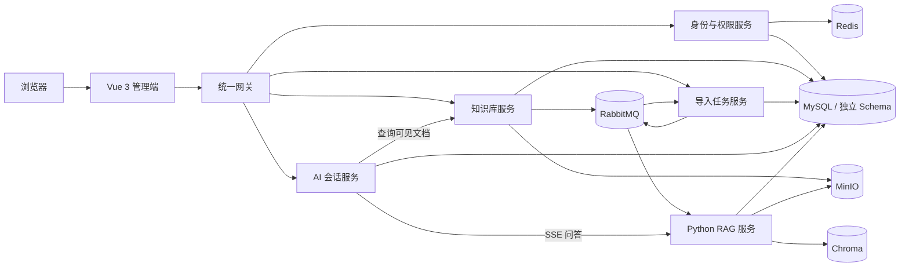

<p align="center">
  
</p>

<h1 align="center">DocBase</h1>

<p align="center">
  企业知识库与 RAG 智能问答微服务平台
</p>

<p align="center">
  
  
  
  
  
</p>

DocBase 面向企业内部知识沉淀、文档共享与智能检索场景，提供知识库管理、文档全生命周期、
异步入库、组织权限控制和多知识库 AI 问答能力。系统以 Java 服务承载业务与权限边界，
以 Python 服务完成多格式文档解析、向量检索和流式生成，并在回答末尾提供可追溯的引用来源。

> 本仓库不包含任何真实密码、模型 API Key 或私钥。运行前请根据
> [`.env.example`](.env.example) 创建本地配置。

## 核心能力

| 模块 | 能力 |
| --- | --- |
| 知识库管理 | 知识库、目录分类、成员协作，以及文档上传、预览、编辑、版本更新、重新入库和删除 |
| 异步导入任务 | 任务状态跟踪、可靠事件投递、幂等消费、延迟重试、死信兜底和处理结果回传 |
| 结构化文档处理 | 解析 PDF、Word、Excel、PPT 等格式，保留标题路径、页码、Sheet、Slide 与表格结构 |
| RAG 智能问答 | 可选单个或多个知识库，支持问题改写、向量召回、去重、MMR 排序、上下文构建和 SSE 流式回答 |
| 权限与组织 | 用户注册与认证、RBAC、菜单与按钮权限、组织树、公开/部门/私有知识可见范围 |
| 安全检索 | 由业务服务计算可见文档集合，在向量召回阶段再次过滤，阻止越权片段进入大模型上下文 |

## 系统架构



所有客户端请求统一经过 Gateway。Gateway 会清理客户端伪造的身份请求头并验证 JWT，业务
服务仍会独立完成认证与授权，不把网关作为唯一安全边界。Java 服务通过 Nacos 完成注册发现
与配置管理；短请求使用同步调用，AI 长连接使用 WebClient 转发 SSE。

### 文档入库链路

```text
文档上传到 MinIO
  → Knowledge 在本地事务中保存文档并写入 Outbox
  → RabbitMQ 可靠投递事件
  → Ingest 幂等创建任务并维护状态机
  → RAG 解析、清洗、分块、Embedding 并写入 Chroma
  → 处理结果回传 Ingest，任务状态同步到前端
```

文档更新时先构建新版本向量，再切换活动版本；删除时先从业务可见范围排除，再异步清理
向量。消息发布失败会进入延迟重试，超过上限后进入死信处理，避免业务记录与向量索引长期失配。

### 权限下沉到检索层

```text
用户选择知识库
  → Chat 向 Knowledge 查询当前用户可见的文档 ID
  → RAG 仅在这些文档 ID 范围内召回 Chunk
  → 去重与排序后构建上下文
  → LLM 流式生成回答并返回独立引用来源
```

权限过滤发生在向量召回阶段，而不是只在页面或接口层隐藏数据，因此无权限内容不会进入
Prompt，也不会通过回答被间接泄露。

## 服务说明

| 服务 | 主要职责 | 数据与依赖 |
| --- | --- | --- |
| `gateway-service` | 统一入口、路由、初步认证、限流与 Trace ID | Nacos、Redis |
| `iam-service` | 登录注册、用户、角色、菜单、组织与权限计算 | MySQL、Redis |
| `knowledge-service` | 知识库、目录、文档、成员、可见范围与 Outbox | MySQL、MinIO、RabbitMQ |
| `ingest-service` | 导入任务、状态机、幂等消费、重试及结果反馈 | MySQL、RabbitMQ |
| `chat-service` | 会话管理、多知识库绑定、权限编排与 SSE 转发 | MySQL、Redis |
| `rag-service` | 文档解析、清洗、分块、Embedding、检索排序与回答生成 | Python、Chroma、MinIO |
| `web` | 管理端、知识库工作区、导入任务和 AI 对话界面 | Vue 3、Element Plus |

## 技术栈

| 层级 | 主要技术 |
| --- | --- |
| Java 服务 | Java 21、Spring Boot 3.5、Spring Cloud 2025、Spring Cloud Alibaba、Spring Security、MyBatis-Plus、Flyway |
| Python / RAG | Python 3.11、FastAPI、LangChain、BGE-M3、Chroma、OpenAI-compatible Chat API |
| Web | Vue 3、TypeScript、Vite、Pinia、Vue Router、Element Plus |
| 基础设施 | MySQL 8.4、Redis、RabbitMQ、MinIO、Nacos、Docker Compose |
| 可观测性 | Actuator、Prometheus、Grafana、Zipkin、统一 Trace ID |

## 快速开始

### 1. 环境要求

- Windows 10/11 与 PowerShell 5.1+
- JDK 21
- Docker Desktop 与 Docker Compose v2
- Git
- OpenSSL（用于生成本地 RS256 密钥）

项目包含 Maven Wrapper，无需额外安装 Maven。BGE-M3 在本地运行，不需要 Embedding API Key，
但需要可用的 Hugging Face 模型缓存。

### 2. 克隆并创建本地配置

```powershell
git clone https://github.com/YDL1111/DocBase-Microservices.git
Set-Location DocBase-Microservices
Copy-Item .env.example .env
```

编辑 `.env`，至少完成以下配置：

- 替换所有 `change-me-*`、`replace-with-*` 占位值；
- 设置 `HF_HOME` 指向本机 Hugging Face 缓存；
- 配置 `CHAT_API_KEY`、`CHAT_BASE_URL` 和 `CHAT_MODEL`；
- 为首次管理员初始化设置 32～256 位的 `IAM_ADMIN_SETUP_KEY`。

`.env` 已加入 `.gitignore`，请勿提交真实密钥。

### 3. 生成本地 JWT 密钥

```powershell
New-Item -ItemType Directory -Force .local/keys | Out-Null
openssl genpkey -algorithm RSA -pkeyopt rsa_keygen_bits:2048 `
  -out .local/keys/docbase-iam-private.pem
openssl pkey -in .local/keys/docbase-iam-private.pem -pubout `
  -out .local/keys/docbase-iam-public.pem
```

私钥仅供 IAM 签发 Token，Gateway 和其他服务只读取公钥。`.local/` 已被 Git 忽略。

### 4. 启动项目

```powershell
# 启动并初始化 MySQL、Redis、RabbitMQ、MinIO、Nacos
.\scripts\start-infra.ps1

# 编译测试并启动全部应用
.\scripts\start-apps.ps1
```

首次构建耗时取决于 Maven、npm、Python 依赖和模型缓存情况。启动完成后访问：

- Web 管理端：<http://localhost:3000>
- Gateway 健康检查：<http://localhost:8080/actuator/health>
- Nacos 控制台：<http://localhost:18080>
- RabbitMQ 控制台：<http://localhost:15672>
- MinIO 控制台：<http://localhost:9001>

当数据库中不存在有效超级管理员时，登录页会显示“初始化管理员”入口。使用 `.env` 中的
`IAM_ADMIN_SETUP_KEY` 创建第一个管理员后，建议清空该变量并重新构建 `iam-service`。
普通用户是否可以自助注册由 `IAM_REGISTRATION_ENABLED` 控制。

### 5. 日常管理

```powershell
.\scripts\status.ps1    # 查看服务状态
.\scripts\stop.ps1      # 停止服务，保留容器、网络和数据卷
.\scripts\start-apps.ps1 -SkipBuild  # 使用现有镜像重新启动
.\scripts\down.ps1      # 删除容器和网络，仍保留命名卷
.\scripts\verify.ps1    # 编译、测试、配置校验与基础冒烟
```

日常关闭请优先使用 `stop.ps1`。不要随意执行 `docker compose down -v`，否则会删除本地数据卷。

## 本地端口

| 组件 | 地址 | 说明 |
| --- | --- | --- |
| Web | `http://localhost:3000` | 用户访问入口 |
| Gateway | `http://localhost:8080` | 唯一业务 API 入口 |
| MySQL | `127.0.0.1:3309` | 仅开发覆盖配置暴露 |
| Nacos | `8848` / `http://localhost:18080` | API / 控制台 |
| RabbitMQ | `http://localhost:15672` | 管理控制台 |
| MinIO | `http://localhost:9000` / `http://localhost:9001` | API / 控制台 |
| Grafana | `http://localhost:3001` | `observability` profile |
| Prometheus | `http://localhost:9090` | `observability` profile |
| Zipkin | `http://localhost:9411` | `observability` profile |

IAM、Knowledge、Ingest、Chat 和 RAG 服务不直接暴露宿主机端口，仅可通过 Gateway 或 Compose
内部网络访问。

## 项目结构

```text
DocBase-Microservices/
├─ services/       # Gateway 与 4 个 Java 业务服务
├─ libraries/      # BOM、通用 Web/Security 能力与事件契约
├─ rag-service/    # Python FastAPI RAG 服务
├─ web/            # Vue 3 管理端与 AI 对话界面
├─ database/       # MySQL Schema、账号与 Nacos 初始化脚本
├─ deploy/         # Compose、服务治理和可观测性配置
├─ scripts/        # Windows PowerShell 启停、重置与验证脚本
└─ docs/           # 架构、安全、RAG、API、事件契约与运行手册
```

## 文档导航

完整目录与推荐阅读顺序见 [项目文档中心](docs/README.md)。

| 文档 | 内容 |
| --- | --- |
| [系统架构](docs/architecture/overview.md) | 服务边界、核心链路、数据归属与基础设施 |
| [身份认证与数据权限](docs/architecture/security.md) | JWT、RBAC、菜单归属、组织范围与检索权限 |
| [RAG 文档处理与问答链路](docs/architecture/rag.md) | 解析、清洗、分块、召回、重排、生成与引用 |
| [API 接口索引](docs/api/README.md) | IAM、Knowledge、Ingest 与 Chat 接口入口 |
| [文档入库事件契约](docs/events/README.md) | Outbox、任务事件、幂等、重试与版本兼容 |
| [本地运行手册](docs/runbook/README.md) | 环境配置、启停、重建、验证与常见问题 |

## 安全说明

- 真实 `.env`、JWT 私钥和本地模型缓存不得提交到仓库；
- Gateway 会移除客户端传入的 `X-User-*` 身份头，业务服务仍独立验签和授权；
- 内部服务调用使用独立 API Key，RAG 检索使用业务侧计算的可见文档集合；
- 生产环境应使用 Secret 管理系统替代本地文件和普通环境变量，并关闭不必要的宿主机端口；
- 修改初始化账号密码不会自动更新已有数据卷中的账号，请先阅读运行手册再处理持久化环境。

---

如果这个项目对你有帮助，欢迎通过 Issue 交流使用过程中遇到的问题。
