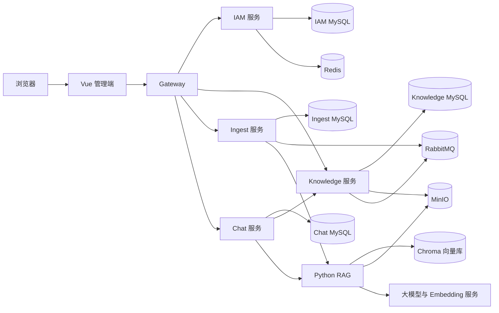

# 系统架构

DocBase 是面向企业文档沉淀与知识问答的应用系统。Java 服务负责身份、权限、知识资产、导入任务和会话编排，Python RAG 服务负责文档解析、向量检索与大模型生成，Vue 管理端通过统一网关访问后端。

## 总体结构



## 服务职责

| 服务 | 主要职责 | 持久化数据 |
| --- | --- | --- |
| `gateway-service` | 统一入口、路由、跨域、请求头清理、限流和访问日志 | 无业务数据 |
| `iam-service` | 登录注册、用户、角色、菜单、组织、JWT 与权限计算 | `docbase_iam`、Redis |
| `knowledge-service` | 知识库、目录、成员、文档、版本、可见范围和 Outbox | `docbase_knowledge`、MinIO |
| `ingest-service` | 导入任务、状态机、重试、幂等消费和 RAG 调度 | `docbase_ingest` |
| `chat-service` | 会话、消息、知识库绑定、可见文档查询和 SSE 编排 | `docbase_chat` |
| `rag-service` | 解析、清洗、分块、Embedding、检索排序、上下文构建和生成 | Chroma、MinIO |
| `web` | 管理端、知识库操作、任务查看和 AI 对话 | 浏览器本地状态 |

每个业务服务只访问自己拥有的数据库。跨服务信息通过 HTTP、领域事件或 JWT 声明传递，避免共享表造成隐式耦合。

## 核心业务链路

### 文档入库

```text
浏览器上传文件
  → Knowledge 校验文件并写入 MinIO
  → 文档记录与 Outbox 事件在同一事务提交
  → Ingest 幂等消费事件并创建任务
  → Ingest 调用 RAG 解析、清洗、分块和向量化
  → RAG 原子切换活动向量版本
  → Ingest 发布结果事件
  → Knowledge 更新文档入库状态
```

上传接口使用 `clientRequestId` 保证重复请求不会生成多份文档。任务失败后按照状态机重试；文档更新先构建新索引再切换版本，避免查询读到半成品。

### AI 问答

```text
用户发送问题
  → Chat 校验会话所有权和知识库绑定
  → Knowledge 计算当前用户可见文档 ID
  → RAG 在可见范围内进行查询改写、召回、去重和排序
  → 按完整 Chunk 构建上下文并调用大模型
  → Chat 通过 SSE 返回 Token、引用来源和结束状态
  → 会话历史成为最终结果依据
```

用户可以不绑定知识库，也可以绑定一个或多个知识库。绑定知识库时，可见文档集合由业务侧计算，RAG 不接受客户端自行声明的文档权限。

## 一致性与可靠性

- Knowledge 使用事务 Outbox，保证业务数据与待发布事件同时提交。
- Ingest 使用事件 ID 和业务键做幂等处理，重复投递不会重复创建有效任务。
- 导入任务通过有限状态机约束重试、取消、成功和失败转换。
- 文档向量采用版本化写入与活动版本切换，更新失败不会破坏旧索引。
- Chat 使用 `clientRequestId` 防止不确定网络结果造成重复提问。
- SSE 中断后，前端以持久化会话历史进行核对，不把未知结果误判为成功。

## 基础设施

- Nacos：服务发现与集中配置。
- MySQL：各 Java 业务服务的独立 Schema。
- Redis：会话撤销、授权版本和网关共享限流。
- RabbitMQ：文档事件与入库状态事件。
- MinIO：原始文档与解析输入。
- Chroma：文档 Chunk 与向量索引。
- Prometheus、Grafana：指标采集与可视化配置。

更多内容：

- [身份认证与数据权限](security.md)
- [RAG 文档处理与问答链路](rag.md)
- [事件契约](../events/README.md)
