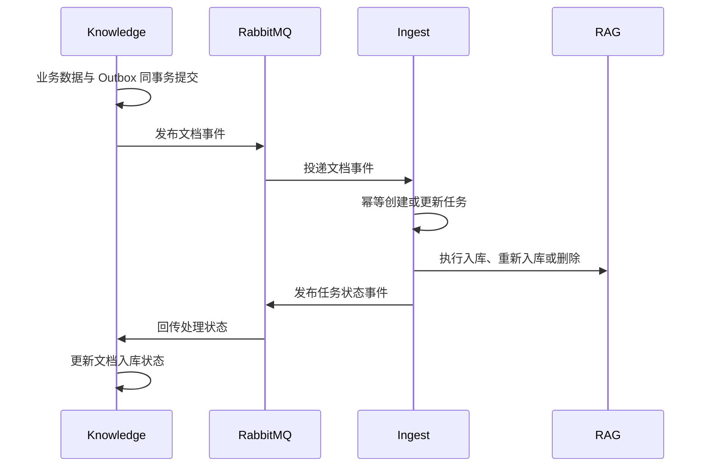

# 文档入库事件契约

Knowledge 与 Ingest 通过 RabbitMQ 事件解耦文档业务和耗时的 RAG 处理。事件模型定义在 `libraries/event-contracts`，生产者和消费者共享契约代码，但不共享业务数据库。

## 整体流向

## 知识库服务发布的事件

| 事件类型 | 含义 | Ingest 行为 |
| --- | --- | --- |
| `knowledge.base.created` | 知识库创建 | 记录领域变化，不创建文档任务 |
| `knowledge.base.deleted` | 知识库删除 | 触发相关资源清理逻辑 |
| `knowledge.document.registered` | 新文档完成登记 | 创建导入任务 |
| `knowledge.document.reingest-requested` | 请求重新构建索引 | 创建重新入库任务 |
| `knowledge.document.deleted` | 文档已从业务侧删除 | 取消待处理任务并创建向量删除任务 |

Knowledge 在业务事务中写入 `event_outbox`。只有事务提交成功的事件才会被后台发布器发送，避免出现“数据库没有文档但队列已有导入消息”。

Knowledge 事件主要字段：

| 字段 | 说明 |
| --- | --- |
| `eventId` | 全局唯一事件 ID，消费者幂等键 |
| `eventType` | 事件类型 |
| `aggregateType` / `aggregateId` | 聚合类型与标识 |
| `knowledgeBaseId` / `documentId` | 业务资源 ID |
| `objectKey` | RAG 读取原文件所需的内部对象 Key |
| `operatorId` | 操作者用户 ID |
| `schemaVersion` | 契约版本 |
| `occurredAt` | UTC 发生时间 |

## 导入服务发布的事件

| 事件类型 | 含义 | Knowledge 行为 |
| --- | --- | --- |
| `ingest.document.processing` | 任务开始处理 | 标记文档处理中 |
| `ingest.document.dispatched` | 已提交给 RAG | 记录调度状态 |
| `ingest.document.succeeded` | 解析和索引成功 | 标记文档可用于检索，清除旧错误 |
| `ingest.document.failed` | 本次处理失败 | 记录安全错误码和重试状态 |
| `ingest.document.deleted` | 向量数据已删除 | 完成删除同步 |

Ingest 事件除通用字段外，还携带任务 ID 和 `ingestStatus`。文档最终状态以 Knowledge 消费到的事件为准，不由浏览器直接修改。

## 可靠性约定

### 幂等

- 消费者使用 `eventId` 记录处理结果，重复投递不能重复产生业务副作用。
- 导入任务还使用文档、任务类型和版本等业务键限制重复有效任务。
- RAG 写入使用文档版本隔离，重复调用不得产生多个活动索引。

### 重试与死信

发布或消费失败后进入有限重试；超过上限的消息进入失败或死信状态，等待人工检查。重试必须保留原 `eventId`，不能通过生成新 ID 绕过幂等。

### 顺序与过期事件

同一文档可能连续发生上传、重新入库和删除。消费者应比较文档版本和当前任务状态，忽略已经被更新操作取代的迟到事件。不能只依赖 RabbitMQ 的全局顺序。

### 错误信息

事件中只传递稳定错误码和可展示的安全摘要，不传递堆栈、连接串、内部 API Key、完整对象地址或原始文档内容。

## 修改契约的要求

1. 优先新增可选字段，避免改变已有字段语义。
2. 破坏性变更必须提升 `schemaVersion` 并让消费者兼容过渡。
3. 同时更新契约库、生产者、消费者、测试和本文档。
4. 上线顺序应保证消费者先兼容，再由生产者发送新字段或新版本。
